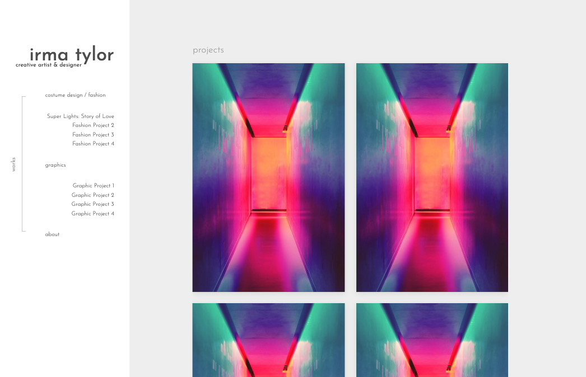
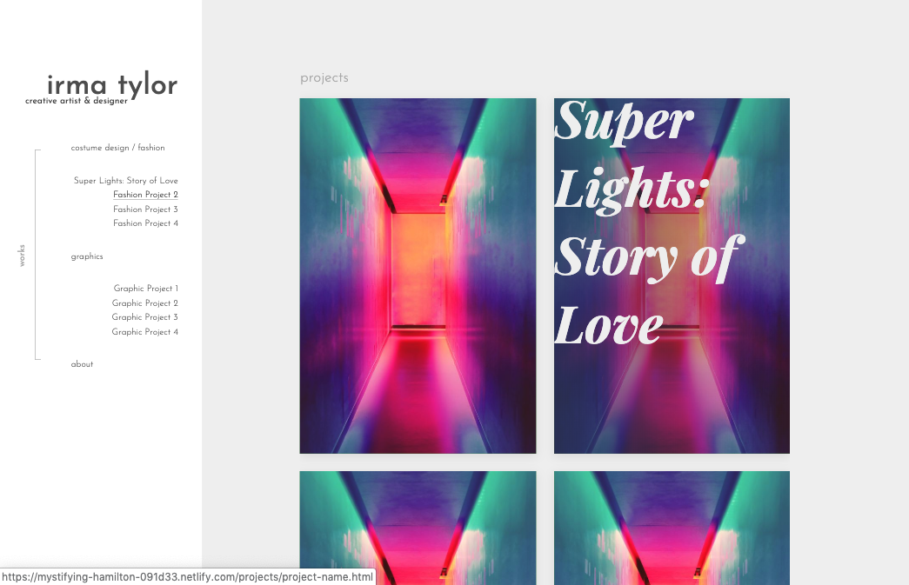
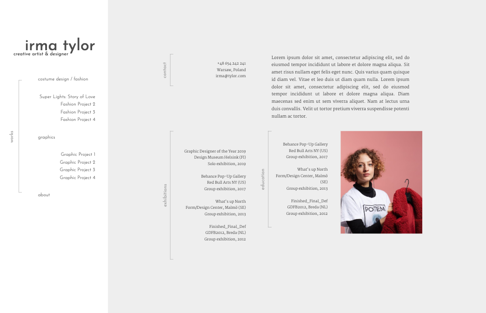
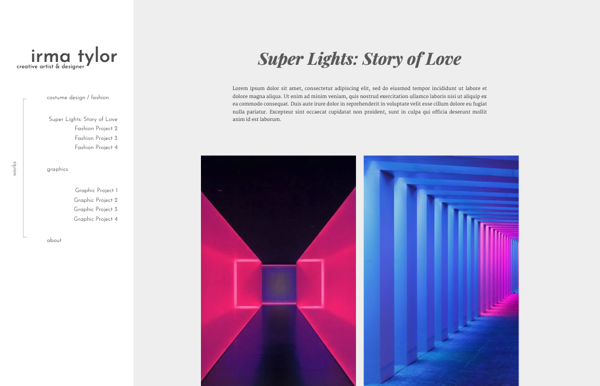
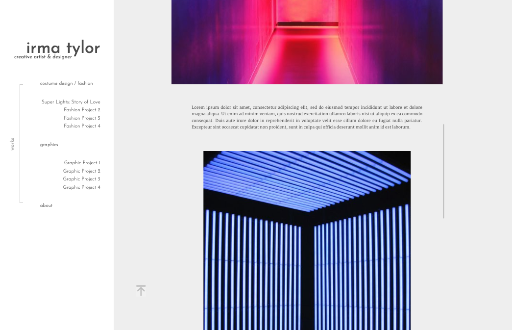
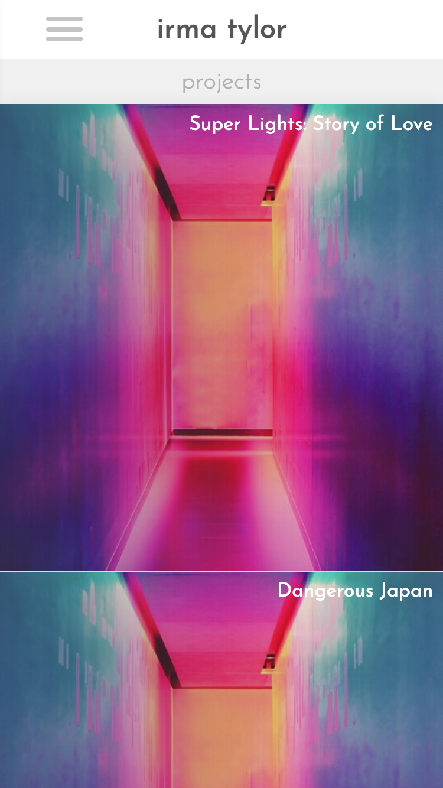
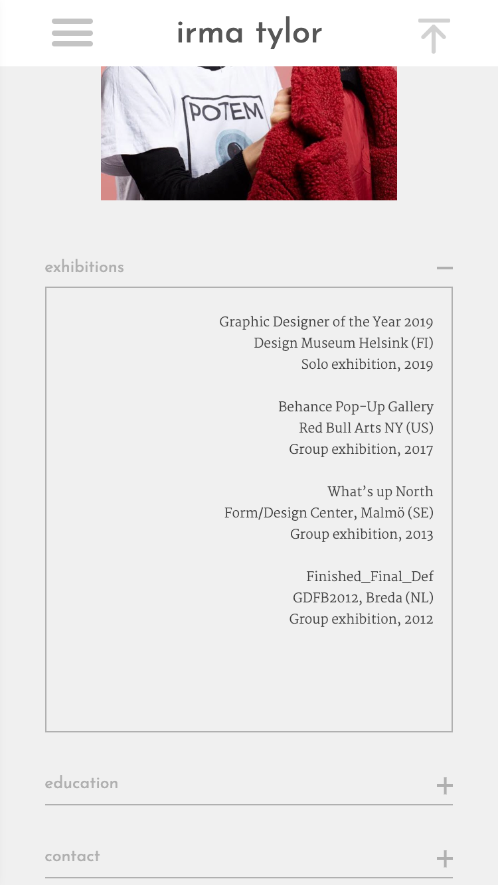

# Portfolio website for artist/designer


Minimalistic design website to show works of my friend - Irma.
>Officially not deployed yet.
>It's waiting for a content.</br>
>Therefore it's filled with mock images and text.


## Install

To run website with live-server in development mode:
```
git clone git@github.com:EmilTheSadCat/irma-tylor-portfolio.git
cd illustration-portfolio
npm install
npm start
```


## Features
- Minimal, simple design
- Fully responsive user interface
- Main gallery attached to buttons in side menu
- Collapsible sections in About page in mobile 
- Custom scroll bar


## Stack

- HTML
- CSS (SASS)
- Vanilla Javascript

## Screenshots

</br>
<sup>Landing page</sup> </br>


</br>
<sup>Landing page with hovered button</sup> </br>


</br>
<sup>About page</sup> </br>


</br>
<sup>Project page</sup> </br>


</br>
<sup>Project page further</sup> </br>


</br>
<sup>Landing page mobile</sup> </br>


</br>
<sup>Collapsible sections in About page mobile</sup> </br>


## Links

- Live: https://mystifying-hamilton-091d33.netlify.com/
- Repository: https://github.com/EmilTheSadCat/irma-tylor-portfolio


## Licensing

The code in this project is licensed under ISC license.